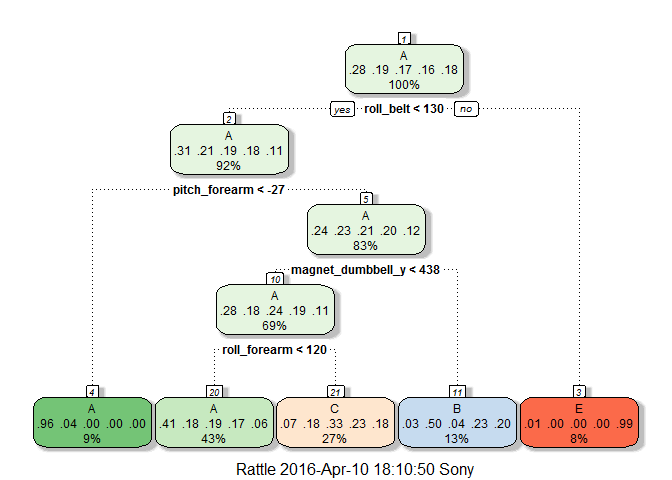
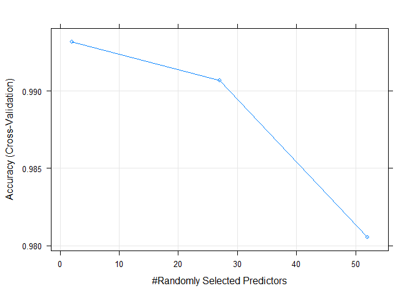

### Executive summary:

This document is the report created for Practical machine learning
assignment. The intent of the project is to analyze, build the models
using accelerometers data mounted on the belt, forearm, arm, and dumbell
of 6 participants while doing barbell lifts and predict how well they
did the exercise. In the begining of the session information of the
input data is explained and in subsequent session given input data is
cleaned by removing NAs and unwanted variables. With the given data
various models are build and evaluated using different model building
technique such as RPART, Naive Bayes, Linear Discriminant Analysis (LDA)
and Random forest. Out of all the models it seems random forest model
has better accuracy, sensitivity, specificity and precision; this best
build model is selected and used for prediction on test data set with 20
different cases.

### Input data information:

Now a days it is possible to measure and collect large amount of data
using devices like Jawbone Up, Nike FuelBand, and Fitbit for personal
activity and this data can be used to improve health, to find patterns
in the behavior or quantify how much of a particular activity is carried
out.

The given data set consist of accelerometers measurements taken on belt,
forearm, arm and dumbell of 6 participants while they doing barbell
lifts. These 6 participants were asked to perform barbell lifts
correctly and incorrectly in 5 different ways marked as class A, B, C, D
and E under supervison of an experienced weight lifter. The description
of these different classes is as below.

Class A: Exactly according to the specification  
Class B: Throwing the elbows to the front  
Class C: Lifting the dumbbell only halfway  
Class D: Lowering the dumbbell only halfway  
Class E: Throwing the hips to the front

So class-A corresponds to specified execution of exercise and other four
classes are mistakes done during exercise. You can find out more details
of related information at <http://groupware.les.inf.puc-rio.br/har>

The training and test data set can be downloaded from below links.  
**Training data set:**
<https://d396qusza40orc.cloudfront.net/predmachlearn/pml-training.csv>  
**Test data set:**
<https://d396qusza40orc.cloudfront.net/predmachlearn/pml-testing.csv>

### Reading and Cleaning the Data:

The training and test data sets are downloaded from the links provided
above. The below chunk of code reads the input data.

    setwd("D:/DATA SCIENCE/8.Practical Machine Learning/Assignment")
    training <- read.csv("pml-training.csv")
    test <- read.csv("pml-testing.csv")

Now we can split given training data set in training subset ans testing
subset so that we can build model based on training subset and evaluate
those models on testing subset.

    set.seed(111)
    library(caret)

    ## Loading required package: lattice
    ## Loading required package: ggplot2

    inTrain <- createDataPartition(training$classe, p=0.7, list=FALSE)
    training_sub <- training[inTrain, ]
    testing_sub <- training[-inTrain, ]

    #head(training_sub)

If we look at few observations in the data set we can see that it has
lot of missing values and NA. Before proceeding ahead we need to clen
the data set. As a first step we can use function nearZeroVar() to
identify which columns has identical values (with nearly zero variance)
and remove it.

    NZV <- nearZeroVar(training_sub)
    #NZV

    training_sub <- training_sub[, -NZV]
    testing_sub <- testing_sub[, -NZV]
    #dim(training_sub)
    #dim(testing_sub)

In second step we can identify the columns containing more than 90% of
NAs and remove those columns from data set.

    withNAs <- sapply(training_sub, function(x) mean(is.na(x)) > 0.9)
    training_sub <- training_sub[, withNAs == FALSE]
    testing_sub <- testing_sub[, withNAs == FALSE]
    #dim(training_sub)
    #dim(testing_sub)
    #head(training_sub)

Also the first few columns in the data set like X, user-name,
raw-timestamp-part1, raw-timestamp-part2, cvtd-timestamp, num-window are
not predictors and not needed for prediction so we can remove them too.

    training_sub <- training_sub[, -(1:6)]
    testing_sub <- testing_sub[, -(1:6)]

    #dim(training_sub)
    #dim(testing_sub)
    #head(training_sub)
    #head(training_sub)

### Model building, Evaluation and Model selection:

In this sections we will build different models using training subset
and evaluate them based on model accuracy. The different algorithmas
that are considered are Recursive Partitioning and Regression Trees
(RPART), Naive Bayes, Linear Discriminant Analysis (LDA) and Random
forest.

#### 1.Recursive Partitioning and Regression Trees (RPART):

To start with let us build RPART model and evaluate it.

    library(rattle)

    model_dp_rpart <- train(classe ~ ., data=training_sub, method = "rpart")
    #model_dp_rpart
    fancyRpartPlot(model_dp_rpart$finalModel)

    confusionMatrix(predict(model_dp_rpart, testing_sub), testing_sub$classe)

    ## Confusion Matrix and Statistics
    ## 
    ##           Reference
    ## Prediction    A    B    C    D    E
    ##          A 1506  480  461  424  165
    ##          B   25  370   33  160  129
    ##          C  138  289  532  380  291
    ##          D    0    0    0    0    0
    ##          E    5    0    0    0  497
    ## 
    ## Overall Statistics
    ##                                           
    ##                Accuracy : 0.4936          
    ##                  95% CI : (0.4808, 0.5065)
    ##     No Information Rate : 0.2845          
    ##     P-Value [Acc > NIR] : < 2.2e-16       
    ##                                           
    ##                   Kappa : 0.3387          
    ##  Mcnemar's Test P-Value : NA              
    ## 
    ## Statistics by Class:
    ## 
    ##                      Class: A Class: B Class: C Class: D Class: E
    ## Sensitivity            0.8996  0.32485   0.5185   0.0000  0.45933
    ## Specificity            0.6367  0.92689   0.7740   1.0000  0.99896
    ## Pos Pred Value         0.4960  0.51604   0.3264      NaN  0.99004
    ## Neg Pred Value         0.9410  0.85120   0.8839   0.8362  0.89132
    ## Prevalence             0.2845  0.19354   0.1743   0.1638  0.18386
    ## Detection Rate         0.2559  0.06287   0.0904   0.0000  0.08445
    ## Detection Prevalence   0.5159  0.12184   0.2770   0.0000  0.08530
    ## Balanced Accuracy      0.7682  0.62587   0.6463   0.5000  0.72915

From the output of confusion matrix we see that RPART model has very
poor accuracy indicating that classifier is correct very few times while
predicting the classes and this is not good estimate of out of sample
error. It has better sensitivity that means it is better at predicting
true positives but has quite low specificity as well as low precision
i.e Pos Pred Value.

#### 2.Naive Bayes model with repeated k-fold cross validation:

    train_control_rkf_nb <- trainControl(method = "repeatedcv", number = 5, repeats = 2)
    model_rkf_nb <- train(classe ~ ., data=training_sub, trControl=train_control_rkf_nb, method="nb")
    #model_rkf_nb

    confusionMatrix(predict(model_rkf_nb, testing_sub), testing_sub$classe)

    ## Confusion Matrix and Statistics
    ## 
    ##           Reference
    ## Prediction    A    B    C    D    E
    ##          A 1467  228  258  174   68
    ##          B   25  735   61    2  103
    ##          C   70  104  677  112   36
    ##          D  105   52   29  627   44
    ##          E    7   20    1   49  831
    ## 
    ## Overall Statistics
    ##                                           
    ##                Accuracy : 0.737           
    ##                  95% CI : (0.7255, 0.7482)
    ##     No Information Rate : 0.2845          
    ##     P-Value [Acc > NIR] : < 2.2e-16       
    ##                                           
    ##                   Kappa : 0.6635          
    ##  Mcnemar's Test P-Value : < 2.2e-16       
    ## 
    ## Statistics by Class:
    ## 
    ##                      Class: A Class: B Class: C Class: D Class: E
    ## Sensitivity            0.8763   0.6453   0.6598   0.6504   0.7680
    ## Specificity            0.8271   0.9598   0.9337   0.9533   0.9840
    ## Pos Pred Value         0.6683   0.7937   0.6777   0.7316   0.9152
    ## Neg Pred Value         0.9439   0.9185   0.9286   0.9330   0.9496
    ## Prevalence             0.2845   0.1935   0.1743   0.1638   0.1839
    ## Detection Rate         0.2493   0.1249   0.1150   0.1065   0.1412
    ## Detection Prevalence   0.3730   0.1573   0.1698   0.1456   0.1543
    ## Balanced Accuracy      0.8517   0.8025   0.7968   0.8018   0.8760

The Naive Bayes model has quite better accuracy compared to RPART model
still not good estimate of out of sample error. It has good sensitivity
and specificity but low Pos Pred Value.

#### 3.Linear Discriminant Analysis (LDA) with repeated k-fold cross validation:

    train_control_rkf_lda <- trainControl(method = "repeatedcv", number = 5, repeats = 2)
    model_rkf_lda <- train(classe ~ ., data=training_sub, trControl=train_control_rkf_lda, method="lda")
    #model_rkf_lda

    confusionMatrix(predict(model_rkf_lda, testing_sub), testing_sub$classe)

    ## Confusion Matrix and Statistics
    ## 
    ##           Reference
    ## Prediction    A    B    C    D    E
    ##          A 1350  184   95   46   39
    ##          B   35  691   96   48  183
    ##          C  143  157  679  121   96
    ##          D  139   50  128  708  105
    ##          E    7   57   28   41  659
    ## 
    ## Overall Statistics
    ##                                           
    ##                Accuracy : 0.6945          
    ##                  95% CI : (0.6825, 0.7062)
    ##     No Information Rate : 0.2845          
    ##     P-Value [Acc > NIR] : < 2.2e-16       
    ##                                           
    ##                   Kappa : 0.6137          
    ##  Mcnemar's Test P-Value : < 2.2e-16       
    ## 
    ## Statistics by Class:
    ## 
    ##                      Class: A Class: B Class: C Class: D Class: E
    ## Sensitivity            0.8065   0.6067   0.6618   0.7344   0.6091
    ## Specificity            0.9136   0.9237   0.8936   0.9142   0.9723
    ## Pos Pred Value         0.7876   0.6562   0.5677   0.6265   0.8321
    ## Neg Pred Value         0.9223   0.9073   0.9260   0.9462   0.9169
    ## Prevalence             0.2845   0.1935   0.1743   0.1638   0.1839
    ## Detection Rate         0.2294   0.1174   0.1154   0.1203   0.1120
    ## Detection Prevalence   0.2912   0.1789   0.2032   0.1920   0.1346
    ## Balanced Accuracy      0.8600   0.7652   0.7777   0.8243   0.7907

The LDA model has moderate accuracy with quite good sensitivity,
specificity and Pos Pred Value but we don't see much improvement over
previous models.

#### 4.Random Forest:

    library(randomForest)
    train_control_rf <- trainControl(method = "cv", number = 5, verbose=FALSE)
    model_kf_rf <- train(classe ~ ., data=training_sub, method="rf", trControl=train_control_rf)
    #model_kf_rf

    confusionMatrix(predict(model_kf_rf, testing_sub), testing_sub$classe)

    ## Confusion Matrix and Statistics
    ## 
    ##           Reference
    ## Prediction    A    B    C    D    E
    ##          A 1674    4    0    0    0
    ##          B    0 1131    7    0    0
    ##          C    0    4 1019   25    0
    ##          D    0    0    0  938    5
    ##          E    0    0    0    1 1077
    ## 
    ## Overall Statistics
    ##                                           
    ##                Accuracy : 0.9922          
    ##                  95% CI : (0.9896, 0.9943)
    ##     No Information Rate : 0.2845          
    ##     P-Value [Acc > NIR] : < 2.2e-16       
    ##                                           
    ##                   Kappa : 0.9901          
    ##  Mcnemar's Test P-Value : NA              
    ## 
    ## Statistics by Class:
    ## 
    ##                      Class: A Class: B Class: C Class: D Class: E
    ## Sensitivity            1.0000   0.9930   0.9932   0.9730   0.9954
    ## Specificity            0.9991   0.9985   0.9940   0.9990   0.9998
    ## Pos Pred Value         0.9976   0.9938   0.9723   0.9947   0.9991
    ## Neg Pred Value         1.0000   0.9983   0.9986   0.9947   0.9990
    ## Prevalence             0.2845   0.1935   0.1743   0.1638   0.1839
    ## Detection Rate         0.2845   0.1922   0.1732   0.1594   0.1830
    ## Detection Prevalence   0.2851   0.1934   0.1781   0.1602   0.1832
    ## Balanced Accuracy      0.9995   0.9958   0.9936   0.9860   0.9976

Random forest model has very high accuracy, sensitivity, specificity as
well as excellent Pos Pred Value and Neg Pred Value compared to all
other models explored previously.

Now we plot the accuracy vs number of number of randomly selected
predictors for this model.

    plot(model_kf_rf)

Here we will estimate out of sample error rate for random forest model
and we see that this value is very very low.

    pred_kf_rf <- predict(model_kf_rf, testing_sub)
    total_errors <- sum(pred_kf_rf != testing_sub$classe)

    ErrorRate <- total_errors / length(testing_sub$classe)
    ErrorRate    

    ## [1] 0.007816483

### Predictions on test data with Random forest model:

Before we apply our best model i.e. random forest model on test data
set, we need to clean test data set in similar fashion we cleaned
training dataset.

    NZV_test <- nearZeroVar(test)
    #NZV_test

    test <- test[, -NZV_test]

    withNAs_test <- sapply(test, function(x) mean(is.na(x)) > 0.9)
    test <- test[, withNAs_test == FALSE]

    test <- test[, -(1:6)]
    #dim(test)

Now we will apply trained random forest model to test data.

    # Predcting with random forest
    predict_test <- predict(model_kf_rf, test)
    predict_test

    ##  [1] B A B A A E D B A A B C B A E E A B B B
    ## Levels: A B C D E

These predictions are used in the quiz and it is observed that all of
these predictions are accurate. So we can conclude that all of the
models random forest is the best and very robust model.
